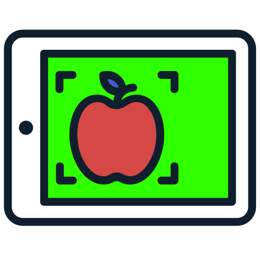

<div align="center">
  

  <h1>ObjectTracker</h1>

  <p>Monitors a USB camera in real time and triggers event-based recording when it detects an object.</p>

  <p>
    <a href="https://www.python.org/"></a>
    <a href="https://opencv.org/"></a>
    <a href="LICENSE"></a>
  </p>
</div>

## Requirements

- Python ≥ 3.10
- [uv](https://docs.astral.sh/uv/)
- A USB camera

## Install

```bash
git clone https://github.com/EdoardoTosin/ObjectTracker.git
cd ObjectTracker
uv sync
```

## Run

```bash
uv run object-tracker
```

Detects `person, car, traffic light` by default (see [config.yaml](config.yaml)) and opens a live preview window.

```bash
uv run object-tracker --objects "person,car" --dual-rate
uv run object-tracker --no-window
uv run object-tracker --help
```

## Documentation

| Guide | Contents |
|---|---|
| [Getting Started](docs/getting-started.md) | Installation, camera setup, first run |
| [Configuration](docs/configuration.md) | `config.yaml` fields, CLI flags, dual-rate thresholds |
| [Docker](docs/docker.md) | Building, Compose, device passthrough |
| [Development](docs/development.md) | Architecture, lint/test/type-check, project layout, credits |
| [Troubleshooting](docs/troubleshooting.md) | Camera, recording, and detection problems |

## Contributing

See [CONTRIBUTING.md](CONTRIBUTING.md) and [docs/development.md](docs/development.md).

## License

This project is licensed under the MIT License. See the [LICENSE](LICENSE) file for more details.
